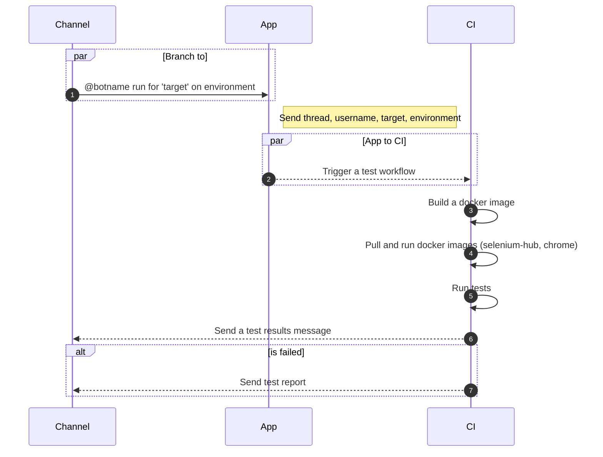

# slack-app-test

Sequence Diagram of Slack App with 

```mermaid
sequenceDiagram
    autonumber
    par Branch to 
        Channel->>App: @botname run for 'target' on environment
    end
    Note right of App: Send thread, username, target, environment
    par App to CI
    App-->>CI: Trigger a test workflow
    end
    CI->>CI: Build a docker image
    CI->>CI: Pull and run docker images (selenium-hub, chrome)
    CI->>CI: Run tests
    CI-->>Channel: Send a test results message
    alt is failed
        CI-->>Channel: Send test report 
    end    
```
