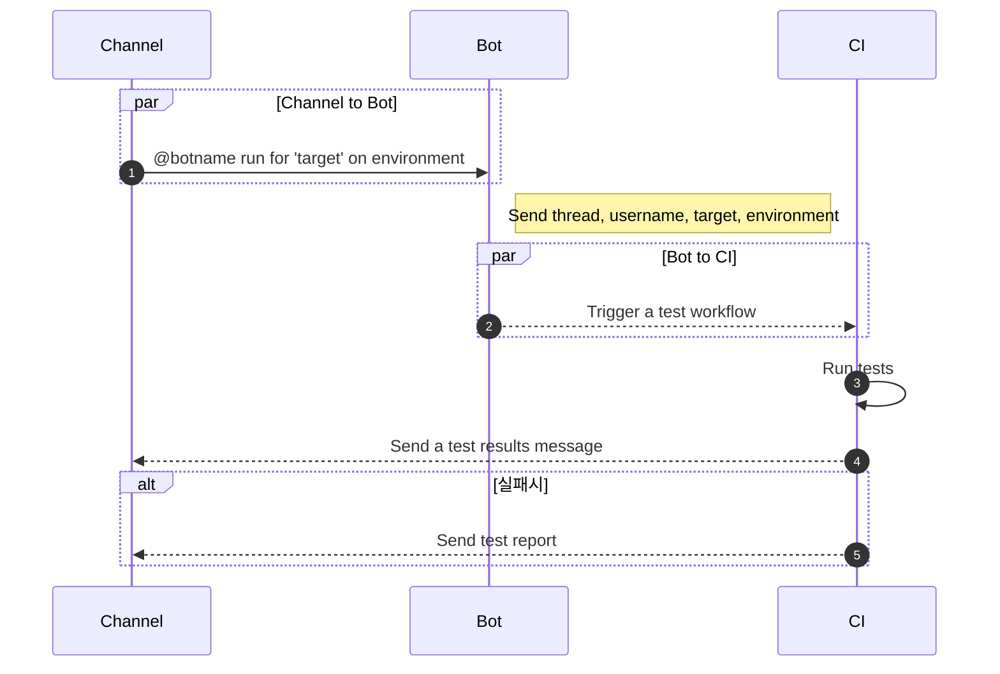

# slack-app-test

```mermaid
sequenceDiagram
    autonumber
    par Channel to Bot
        Channel->>Bot: @botname run for 'target' on environment
    end
    Note right of Bot: Send thread, username, target, environment
    par Bot to CI
    Bot-->>CI: Trigger a test workflow
    end
    CI->>CI: Run tests
    CI-->>Channel: Send a test results message
    alt 실패시 
        CI-->>Channel: Send test report 
    end    
```
